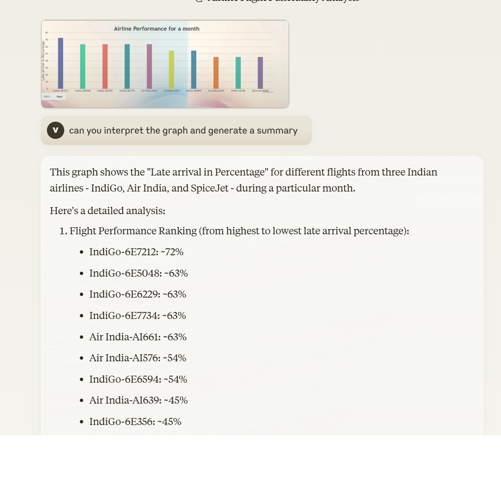
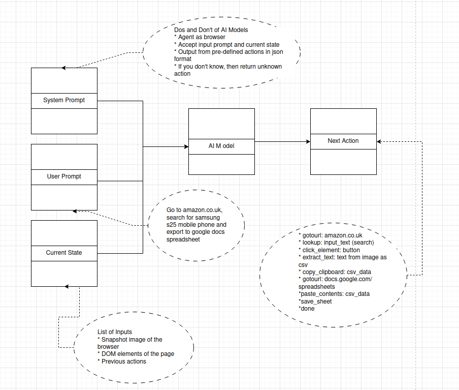
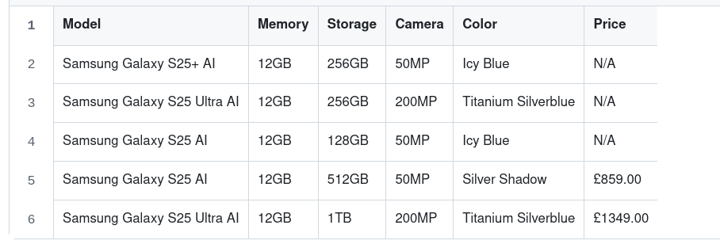
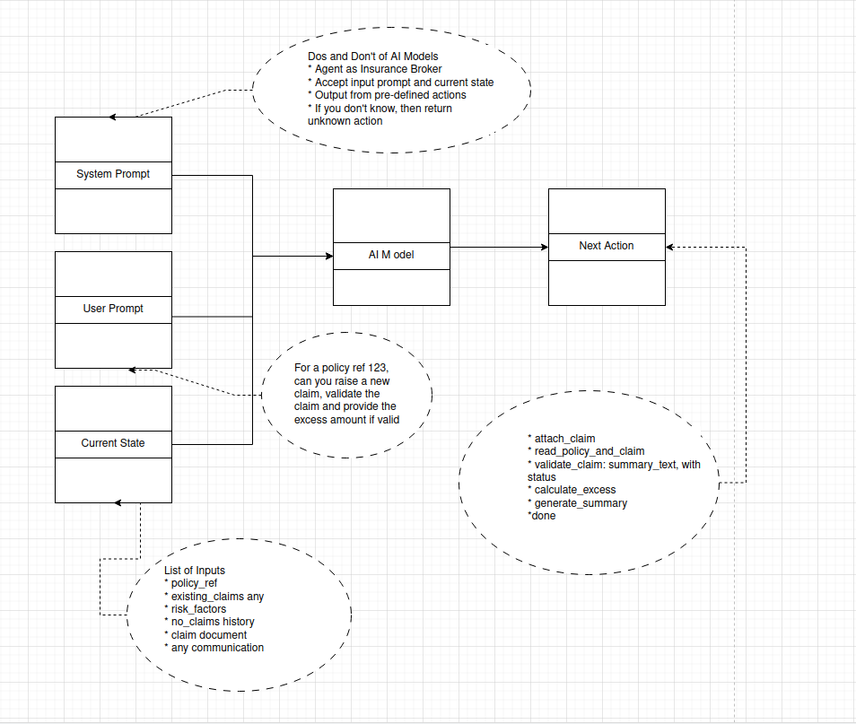

# AI Agent for Automating Business Process

## This post is about how the Automated agents are evolving. 

GenAI is about generating next token from a trained context and sometime it can hallucinate. Slowly learned how to control the generation of next token in a way needed for specific purpose and extended with additional knowledge for the AI model. This resulted in generating more usable code through AI models. And also the accuracy of image recognition and interpretation of texts from image is really helpful in making decisions by the AI models.
The next stage of evolution is once confidently able to generate the next token in a way needed for specific purpose then use that to generate instructions to run them automatically.

## Image recognition by AI model

## Agent for Browser Access

#### There are pre-defined set of actions which are being carried out from browser. This leads to automate the actions of the browser using using AI models.

#### Predifined actions are,

* Start the browser
* Go to a specific Url
* Navigate to a specific page
* Provide values for inputs during filling out forms
* Select from dropdown
* Click Button for actions

### An example of the workflow to look for a specific item in amazon through automated agent is below,

### AI agent in action

* Goes to amazon.co.uk
* Find the search box
* Enter the search string
* Extract the search output as CSV
* Copy to clipboard

### Output of AI Agent

### AI agent workflow design of an medical insurance claim

Similar to browser agent automation, medical insurance claims could be automated through ai agents in a similar way. Below is a workflow design.

* Attach new claim
* Read Policy, Claim, any message communication
* Validate claim against the policy
* Calculate excess
* Finally generate summary

### Summary

* Automation agent is an evolution of GenAI and still solving the business problems and exciting years ahead 
